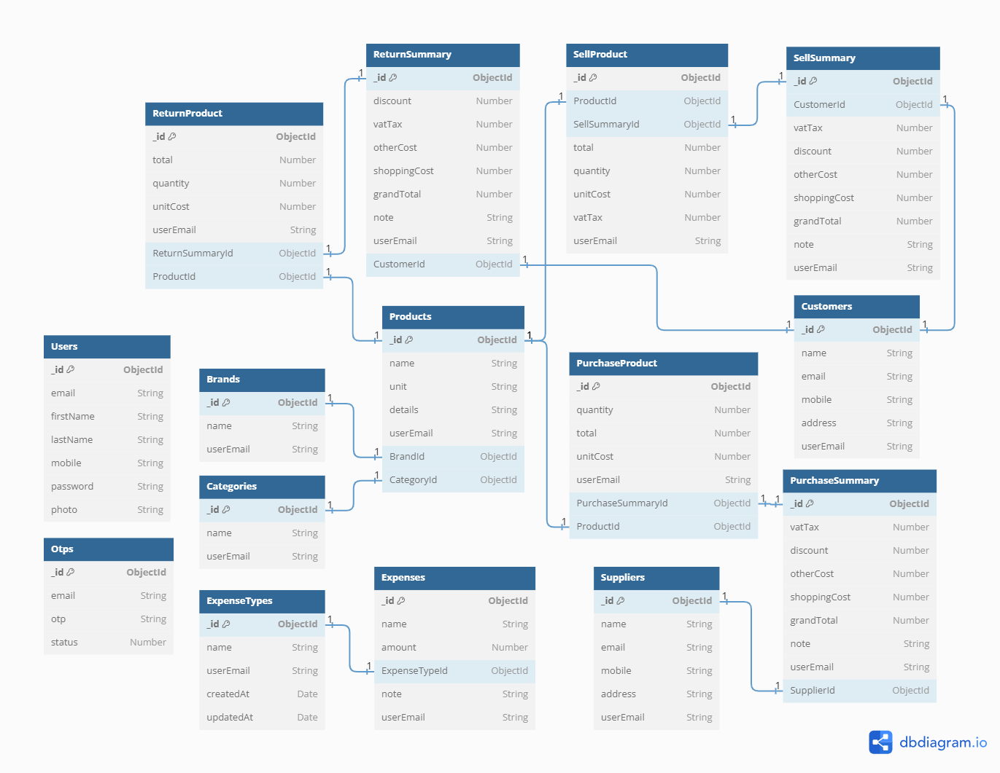

# Inventory Management System

## Project Overview

Inventory management refers to the process of ordering, storing, using, and selling a company's inventory. This includes the management of raw materials, components, and finished products, as well as the warehousing and processing of such items.

### Frontend Live Link: https://inventory-m-s.netlify.app

### Backend API Live Link: https://inventory-management-system-ten.vercel.app

### Postman Documentation: https://documenter.getpostman.com/view/15226030/2sA2rGvKJy

## Why do I build Inventory Management System?

1. To learn industry-standard software development

2. To learn the ins and outs of business application development

3. To utilize this project's experience with other types of business applications

## Technology

1. JavaScript
2. Node.js
3. Express.js
4. MongoDB (Mongoose)
5. React (React-Redux)

## Project Setup

1. Install dependencies and Run the server:

   ```powershell
   # 1. Clone the Repository
   git clone
   # 2. Navigate to the project directory
   cd backend or frontend
   # 3. Install Dependencies
   npm install
   # 4. Run the server
   npm run dev
   ```

1. Setup environment variables:

   ```js
   NODE_DEV = development;
   PORT = 5000;
   DATABASE_URL = your_database_url;
   BCRYPT_SALT_ROUNDS = your_bcrypt_salt_rounds_number;
   JWT_ACCESS_SECRET = your_jwt_access_secret;
   JWT_ACCESS_EXPIRES_IN = your_jwt_access_expires_in;
   JWT_REFRESH_SECRET = your_jwt_refresh_secret;
   JWT_REFRESH_EXPIRES_IN = your_jwt_refresh_expires_in;
   SMTP_USER = your_google_smtp_email;
   SMTP_PASSWORD = your_google_smtp_password;
   RESET_PASS_UI_LINK = your_password_url_link;
   ```

## Features

### Users

- **Business/User Authentication:** Sign Up, Login, Account Recovery/Reset Using OTP Code
- **Profile Management:** Create, Read, Update Profile Information

### Brands

- **Brand Management:** Create, Update, Read/Search/Filter Brand List
- **Deletion:** Delete Brand Item if Unused, Prevent Deletion if Associated with Products

### Categories

- **Category Management:** Create, Update, Read/Search/Filter Category List
- **Deletion:** Delete Category Item if Unused, Prevent Deletion if Associated with Products

### Customers

- **Customer Management:** Create, Update, Read/Search/Filter Customer List
- **Deletion:** Delete Customer Item if Unused, Prevent Deletion if Associated with Sales/Returns

### Suppliers

- **Supplier Management:** Create, Update, Read/Search/Filter Supplier List
- **Deletion:** Delete Supplier Item if Unused, Prevent Deletion if Associated with Purchases

### Expenses

- **Expense Management:** Create, Update, Read/Search/Filter Expense List
- **Deletion:** Delete Expense

### Products

- **Product Management:** Create, Update, Read/Search/Filter Product List
- **Deletion:** Delete Product Item if Unused, Prevent Deletion if Associated with Sales/Purchases/Returns

### Purchases

- **Purchase Management:** Create, Update, Read/Search/Filter Purchase List
- **Deletion:** Delete Purchase with Safety (Transaction Rollback)

### Sales

- **Sales Management:** Create, Update, Read/Search/Filter Sales List
  - **Deletion:** Delete Sale with Safety (Transaction Rollback)
  - **Invoice Generation:** Create and Print Sell Invoice

### Returns

- **Return Management:** Create, Update, Read/Search/Filter Return List
  - **Deletion:** Delete Return with Safety (Transaction Rollback)
  - **Invoice** Generation: Create and Print Return Invoice

### Reports

- **Stock Report:** Includes Alerts
- **Expense Report:** Date Range Filtering
- **Purchase Report:** Date Range Filtering
- **Sales Report:** Date Range Filtering
- **Return Report:** Date Range Filtering
- **Profit/Loss Report:** Date Range Filtering

## End-To-End Business Flow

1. Business Product/Goods Management

2. Business Supplier’s Management

3. Customer’s Management

4. Product Sales Management

5. Product Return Management

6. Product Buy/Purchase Management

7. Business Expense Management

8. Product stock management

9. Business Profit, Loss, and Growth

## Database Design (ER Diagram)


